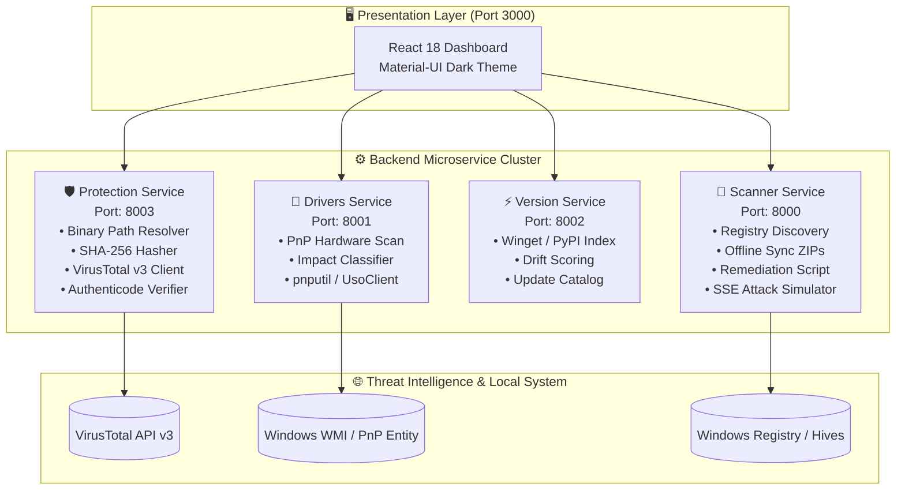

# ⚡ System Revamp

<p align="center">
  <strong>An Enterprise-Grade System Intelligence, Driver Diagnostics, Software Health & Threat Protection Platform</strong>
</p>

<p align="center">
  
  
  
  
  
</p>

---

## 🌟 Overview

**System Revamp** is a high-performance system monitoring and security automation platform. It unites cross-platform software inventory auditing, semantic version drift intelligence, real-time binary threat reputation analysis, hardware driver diagnostics, air-gapped update packaging, and interactive attack simulations into a unified, glassmorphic dark-mode dashboard.

Built with a decoupled **FastAPI microservices architecture** and an interactive **React 18 & Material-UI** frontend, System Revamp provides IT administrators, security engineers, and power users with actionable insights to audit, remediate, and harden their operating system.

---

## ✨ Key Capabilities

| Feature | Description |
|---|---|
| 🖥️ **Deep Software Discovery** | Fast, resilient registry enumeration (`HKLM`/`HKCU`, `WOW6432Node`) on Windows, `dpkg` on Linux, and `system_profiler` on macOS. |
| ⚡ **Version Drift & Risk Scoring** | Real-time version checking against live upstream repositories (Winget, PyPI, Local DB) with semantic drift risk scoring. |
| 🛡️ **Software Protection Center** | Automated binary path resolution, local SHA-256 calculation, and multi-engine threat classification via **VirusTotal API v3** and **Windows Authenticode**. |
| 🔧 **Hardware Driver Diagnostics** | Windows PnP device query engine (`Get-CimInstance Win32_PnPEntity`) identifying missing, corrupted, or disabled drivers with automated installation triggers (`pnputil` / `UsoClient`). |
| 📦 **Air-Gapped & Offline Sync** | Generates full and differential (delta) offline update ZIP bundles containing application snapshots, change manifests, and sync metadata. |
| 📜 **Unattended Remediation Scripts** | Generates tailored PowerShell scripts to automatically update outdated applications via `winget` with one click. |
| 🎯 **Real-Time Attack Simulation** | Streams live Server-Sent Events (SSE) illustrating reconnaissance, CVE detection, and exploit impact for educational security analysis. |

---

## 🏗️ Architecture & Service Topology



---

## 📂 Microservices Port & Endpoint Reference

| Service | Port | Base URL | Primary Role |
|---|---|---|---|
| **Scanner Service** | `8000` | `http://127.0.0.1:8000` | Installed application inventory, ZIP exporter, PowerShell script generation, SSE attack simulator |
| **Driver Service** | `8001` | `http://127.0.0.1:8001` | Hardware driver problem detection, severity scoring, automated update triggers |
| **Version Service** | `8002` | `http://127.0.0.1:8002` | Version comparisons, update status tracking, out-of-date risk evaluation |
| **Protection Service** | `8003` | `http://127.0.0.1:8003` | Executable path resolution, SHA-256 hash checks, VirusTotal reputation, Authenticode verification |

---

## 🔍 Module Deep Dives

### 1. 🛡️ Software Protection & Threat Intelligence
* **Zero-Upload SHA-256 Hashes**: Calculates cryptographic SHA-256 checksums of binaries on disk without transmitting full executables across the network.
* **VirusTotal API v3 Integration**: Queries 70+ antivirus engines to categorize files as `Clean`, `Suspicious`, `Malicious`, or `Unknown` with quantified threat scores (0–100).
* **Layered Offline Fallback**: When no API key is configured or rate limits are reached, the service transparently falls back to local Windows **Authenticode** digital signature validation (`Get-AuthenticodeSignature`).

### 2. 🔧 Hardware Driver Diagnostics & PnP Engine
* **Targeted Error Detection**: Filters specifically for active hardware issues using Windows Plug and Play error codes (e.g. Code 28 for missing drivers, Code 10 for failed start, Code 22 for disabled devices).
* **Impact Classification**: Categorizes driver risks based on subsystem criticality (Storage/CPU = `Critical`, Network = `High`, GPU/Audio = `Medium`).
* **Automated Installation Routines**: Triggers driver updates directly via Windows Update Orchestrator (`UsoClient`) and driver utilities (`pnputil`).

### 3. 📦 Offline Sync & Delta Packager
* **Full & Delta ZIP Packages**: Creates self-contained ZIP archives containing current system state snapshots, version manifests, and differential change logs for air-gapped or restricted networks.
* **Last-Scan Delta Tracking**: Automatically calculates newly added, updated, or removed applications since the previous inventory scan.

### 4. 📜 Automated Remediation Exporter
* **One-Click PowerShell Generator**: Exports clean, non-interactive PowerShell scripts (`winget-remediation.ps1`) to upgrade all outdated software using `winget upgrade --id <AppID> --exact --accept-package-agreements --accept-source-agreements`.

### 5. 🎯 Real-Time Attack Simulation (SSE)
* **Live Telemetry Streaming**: Uses Server-Sent Events (`text/event-stream`) to stream staged security audit steps in real time: Reconnaissance → CVE Signature Matching → Exploit Feasibility → Remediation Guidance.

---

## ⚡ Quick Start Guide

### 1. Prerequisites
* **Python 3.10+** (Added to system PATH)
* **Node.js 18+** & **npm**
* **Windows 10/11** (for full Registry, PnP, and Authenticode capabilities)

---

### 2. Backend Setup & Installation

```powershell
# Clone the repository
git clone https://github.com/Darksider70-yep/System_Revamp.git
cd "System Revamp"

# Create and activate Python virtual environment
python -m venv venv
.\venv\Scripts\Activate.ps1

# Install required Python packages
pip install fastapi uvicorn requests packaging
```

---

### 3. Optional: Configure API Keys & Shared Authentication

1. **VirusTotal API Key (Threat Intelligence)**:
   ```powershell
   # Set in .env or as environment variable:
   $env:VT_API_KEY="your_virustotal_api_key_here"
   # OR save in your user home directory: C:\Users\<YourUser>\.system_revamp_vt_api_key
   ```
   *(If omitted, the Protection Center will automatically use local Authenticode signature validation.)*

2. **Internal Service Authentication (`INTERNAL_API_KEY`)**:
   - Microservices support internal header-based authentication via `X-Internal-Key`.
   - Set `INTERNAL_API_KEY=your-secret-key` in `.env` to enforce authentication across all REST endpoints.
   - Attack simulations use ticket-based single-use tokens (`POST /simulate-attack/token`) to keep API keys completely out of URLs and browser logs.
   - If `INTERNAL_API_KEY` is not set, services default to frictionless local development mode.

> [!TIP]
> **Secrets Safety Guarantee**: VirusTotal API keys, internal auth tokens, and credentials are never logged to execution logs or written to exported remediation scripts. All generated scripts run with `--disable-interactivity` and safe logging practices.

---

### 4. Launch Microservices

Run each service in a dedicated terminal or background process:

```powershell
# Terminal 1: Scanner Service (Port 8000)
uvicorn backend.scanner_service.main:app --host 127.0.0.1 --port 8000 --reload

# Terminal 2: Driver Risk Service (Port 8001)
uvicorn backend.drivers_api:app --host 127.0.0.1 --port 8001 --reload

# Terminal 3: Version Service (Port 8002)
uvicorn backend.version_service.main:app --host 127.0.0.1 --port 8002 --reload

# Terminal 4: Protection Service (Port 8003)
uvicorn backend.protection_service.main:app --host 127.0.0.1 --port 8003 --reload
```

---

### 5. Launch Frontend Dashboard

```powershell
cd frontend
npm install
npm start
```
The dashboard will open automatically at **`http://localhost:3000`**.

---

## 📖 Comprehensive Documentation

Explore in-depth design guides and technical specifications in the [`docs/`](docs/) directory:

* 🏛️ [**Architecture & System Design**](docs/architecture.md): Microservice topology, data flow, and error-handling paradigms.
* 📡 [**API Reference**](docs/api_reference.md): Complete list of REST and SSE endpoints, parameters, and JSON payloads.
* 🛠️ [**Setup & Installation Guide**](docs/setup_and_installation.md): Step-by-step installation, troubleshooting, and configuration instructions.
* 📦 [**Offline Sync & Remediation Engine**](docs/offline_and_remediation.md): Detailed specifications for ZIP sync payloads and winget automation.
* 🛡️ [**Driver & Protection Intelligence**](docs/driver_and_protection_engine.md): Path resolution heuristics, PnP device classification, and malware scoring logic.

---

## 📄 License

This project is licensed under the [MIT License](LICENSE).
