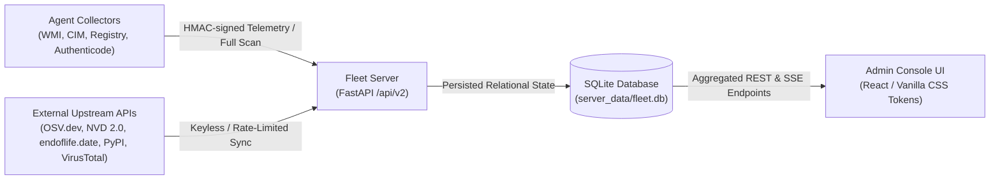

# DATA_LINEAGE.md — System Revamp v2.0 Lineage & Provenance Specification

> **Version**: 2.0.0  
> **Updated**: 2026-10-07  
> **Scope**: Agent Collectors → Server Database & Connectors → Admin API → Console Views  
> **Ground Rule**: Zero hardcoded, fake, or synthetic data outside `tests/`. Every metric, row, status, version, CVE, driver, and hash on screen originates from a verified live telemetry, database, or external upstream connector.

---

## 1. Architecture Flow Overview

---

## 2. Comprehensive Data Lineage Mapping Matrix

| View | UI Widget / Section | Server API Endpoint | Backing DB Table(s) | Agent Collector / Upstream Source | Empty / Missing State Behavior |
|---|---|---|---|---|---|
| **OverviewView** | Total Devices KPI | `GET /api/v2/admin/fleet/overview` | `devices` | Heartbeat & scan telemetry | Shows `0/0 (No devices enrolled)` |
| **OverviewView** | Fleet Compliance KPI | `GET /api/v2/admin/fleet/overview` | `devices`, `device_software`, `device_drivers` | Calculated: clean / total | Shows `N/A (Awaiting scans)` |
| **OverviewView** | Critical Findings KPI | `GET /api/v2/admin/fleet/overview` | `device_software` (risk = 'Critical') | `risk_engine` evaluated | Shows `0 (Zero critical)` with green status |
| **OverviewView** | Pending Commands KPI | `GET /api/v2/admin/fleet/overview` | `commands` (status = 'pending') | Command Queue | Shows `0` with neutral delta |
| **OverviewView** | Stale Agents (>24h) KPI | `GET /api/v2/admin/fleet/overview` | `devices` (`last_heartbeat < 24h`) | Daemon heartbeat loop | Shows `0 (All responsive)` with green status |
| **OverviewView** | Lab Topology Proportions | `GET /api/v2/admin/devices` | `labs`, `devices` | Enrolled lab mapping | Shows `No labs assigned` |
| **OverviewView** | High-Impact Vulnerable Apps | `GET /api/v2/admin/fleet/overview` (`top_outdated_apps`) | `device_software`, `latest_version_cache` | WMI/Registry + OSV/NVD connectors | Shows honest empty box: *"No vulnerable or outdated packages identified across the fleet."* |
| **OverviewView** | PnP Hardware Driver Errors | `GET /api/v2/admin/fleet/overview` (`top_missing_drivers`) | `device_drivers` (`error_code > 0`) | CIM `Win32_PnPEntity` | Shows honest empty box: *"No driver errors detected across the fleet."* |
| **DevicesView** | Enrolled Workstations Table | `GET /api/v2/admin/devices` | `devices`, `device_software`, `device_drivers` | Agent Enrollment & Heartbeat | DataTable empty state: *"No devices matching current filter."* |
| **DeviceDetailView** | System Hardware & OS Metrics | `GET /api/v2/admin/devices/{id}` | `devices` | `agent.collectors.system` (psutil, WMI) | Shows actual values or `-` |
| **DeviceDetailView** | Installed Applications Tab | `GET /api/v2/admin/devices/{id}` (`software`) | `device_software`, `latest_version_cache` | `agent.collectors.software` (Registry, Winget) | Shows *"No software cataloged for this endpoint."* |
| **DeviceDetailView** | Hardware Drivers Tab | `GET /api/v2/admin/devices/{id}` (`drivers`) | `device_drivers` | `agent.collectors.drivers` (CIM Class GUIDs) | Shows *"All drivers operating normally without problem codes."* |
| **DeviceDetailView** | Command Execution & Audit Tab | `GET /api/v2/admin/devices/{id}` (`recent_commands`) | `commands` | `agent.commands.executor` | CodeBlock shows: *"// No remediation or audit commands queued or dispatched to this workstation yet."* |
| **SoftwareView** | Fleet Software Inventory Table | `GET /api/v2/admin/fleet/software` | `device_software` joined across fleet | Registry/Winget + upstream `endoflife.date`/PyPI | DataTable empty state: *"No Software Discovered"* |
| **SoftwareView** | Software Detail Drawer | Drawer modal on row click | `device_software` | Upstream cache + per-device scan | Displays exact hostnames affected and version provenance source (`endoflife.date`, `pypi.org`) |
| **DriversView** | Hardware Diagnostics Table | `GET /api/v2/admin/fleet/drivers?errors_only=true` | `device_drivers` (`error_code > 0`) | `agent.collectors.drivers` (CIM / SetupClass) | DataTable empty state: *"No Driver Hardware Errors"* |
| **DriversView** | Batch Fix Dispatch Modal | `POST /api/v2/commands/queue` | `commands`, `audit_logs` | Server HMAC Command Signing | Dispatches genuine `scan-drivers` or `enable-device` command |
| **ThreatsView** | Binary Reputation Table | `GET /api/v2/threats/overview` | `threat_reputations`, `device_software` | `agent.collectors.software` (SHA256, Authenticode) + VirusTotal | DataTable empty state: *"No Flagged Binary Threats"* |
| **ThreatsView** | VirusTotal API Status Banner | `GET /api/v2/threats/overview` (`vt_api_configured`) | `config.settings.VIRUSTOTAL_API_KEY` | Environment configuration | Informs operator that automated reputation lookup is paused without fake data |
| **RemediationView** | Candidate Software Dropdown | `GET /api/v2/admin/fleet/software` | `device_software`, `latest_version_cache` | Live fleet aggregation | If none: *"No applications cataloged in fleet"* |
| **RemediationView** | Target Scope Workstations | `GET /api/v2/admin/devices` | `devices` | Live device inventory | If none: Button disabled with *"No Target Endpoints Available"* |
| **RemediationView** | Dry-Run Execution Step | `POST /api/v2/commands/queue` (`dry_run: true`) | `commands` | Server HMAC verification + Agent dry-run executor | Real dry-run diff with command signature |
| **RemediationView** | Progressive Rollout Execution | `POST /api/v2/commands/queue` (`dry_run: false`) | `commands` | Real agent command poll & verification scan | Real-time command status polling |
| **ReportsView** | Executive Compliance Metrics | `GET /api/v2/admin/reports/compliance` | `devices`, `device_software`, `device_drivers` | Live database query | Computed from live database counts |
| **ReportsView** | Audited Workstations Summary | `GET /api/v2/admin/reports/compliance` (`devices`) | `devices`, `device_software` | Live database query | If none: *"No enrolled endpoints available for audit report."* |
| **ReportsView** | Genuine CSV Export Download | `GET /api/v2/admin/reports/export?report_type=...` | Live SQL dynamic streaming | Live SQL dataset | Genuine RFC-4180 CSV attachment stream |
| **SettingsView** | University & Lab Hierarchies | `GET /api/v2/admin/hierarchy` | `organizations`, `sites`, `labs`, `devices` | Admin setup / enrollment | If none: *"No organizational topology configured."* |
| **SettingsView** | Central Audit Trail | `GET /api/v2/admin/audit-logs` | `audit_logs` | Server action audit log | DataTable empty state: *"No Audit Logs"* |
| **EnrollmentView** | Scoped Token Generator | `POST /api/v2/admin/enrollment-tokens` | `enrollment_tokens` | Server cryptographically secure token generator | Displays genuine token or blank placeholder until generated |
| **EnrollmentView** | Active Enrollment Tokens Table | `GET /api/v2/admin/enrollment-tokens` | `enrollment_tokens` | DB query | DataTable empty state: *"No Enrollment Tokens"* |
| **LoginView** | Setup Wizard | `GET /api/v2/auth/setup-status` & `POST /api/v2/auth/setup` | `organizations`, `admin_users` | First-run setup | Only rendered when no admin account exists |
| **LoginView** | Administrator Authentication | `POST /api/v2/auth/login` | `admin_users` | PBKDF2-SHA256 password verification | Genuine error messages; zero fallback demo bypass |

---

## 3. Upstream Connector Lineage & Provenance Metadata

Every external record ingested by the server attaches provenance metadata:

1. **Software Versions (`LatestVersionCache`)**:
   - `app_name`: Canonical software identifier.
   - `latest_version`: Upstream resolved SemVer.
   - `source`: `'endoflife.date'`, `'pypi.org'`, or `'local_catalog'`.
   - `fetched_at`: UTC timestamp of resolution.
   - `is_stale`: True if cached data exceeds TTL (7 days) and upstream was unreachable.

2. **Vulnerability Advisories (`VulnerabilityCatalog`)**:
   - `cve_id`: Common Vulnerabilities and Exposures identifier.
   - `app_name`: Target software name.
   - `cvss_score`: CVSS base metric (1.0 to 10.0).
   - `severity`: Standard severity level (LOW, MEDIUM, HIGH, CRITICAL).
   - `cve_source`: `'osv.dev'`, `'nvd.nist.gov'`, or `'offline_bundle'`.
   - `cve_fetched_at`: UTC timestamp of advisory query.

3. **Hardware Drivers (`DeviceDriver`)**:
   - `device_name`: Name of physical hardware component.
   - `device_class_guid`: Standard Windows SetupClass GUID (e.g. `{4d36e968-e325-11ce-bfc1-08002be10318}` for Display).
   - `impact`: Evaluated severity based on Windows Hardware Device Class GUID.
   - `error_code`: CIM Problem Code (0 = OK, 10 = Failed to start, 22 = Disabled, 28 = Driver missing).
   - `source`: `'pnp_entity'`.

---

## 4. Honest Degradation Rules

1. **Missing External API Keys (e.g., VirusTotal)**:
   - System **NEVER** fabricates a "clean" score or fake detections.
   - The UI surfaces a neutral information banner explaining that the key is missing (`VT_API_KEY`) and automated hash lookups are paused.
2. **Offline Endpoints & Network Partitions**:
   - Out-of-date agents retain their last known timestamp with `is_stale = true` and `is_online = false`.
   - The UI indicates stale timestamps honestly without guessing current state.
3. **Absence of Endpoints / Initial Startup**:
   - Empty collections render informative empty states with guidance on how to enroll agents or run initial setup.
   - No mock rows or placeholder records are rendered under any circumstances.
