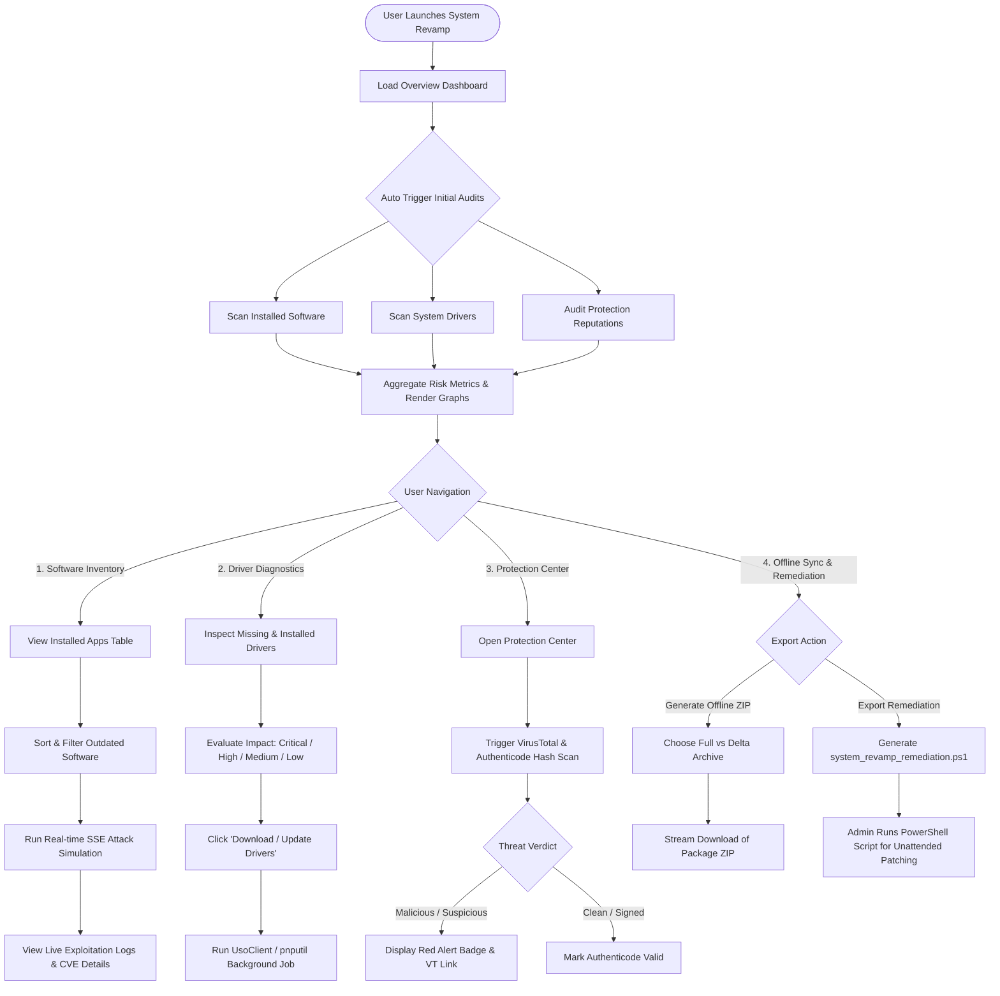
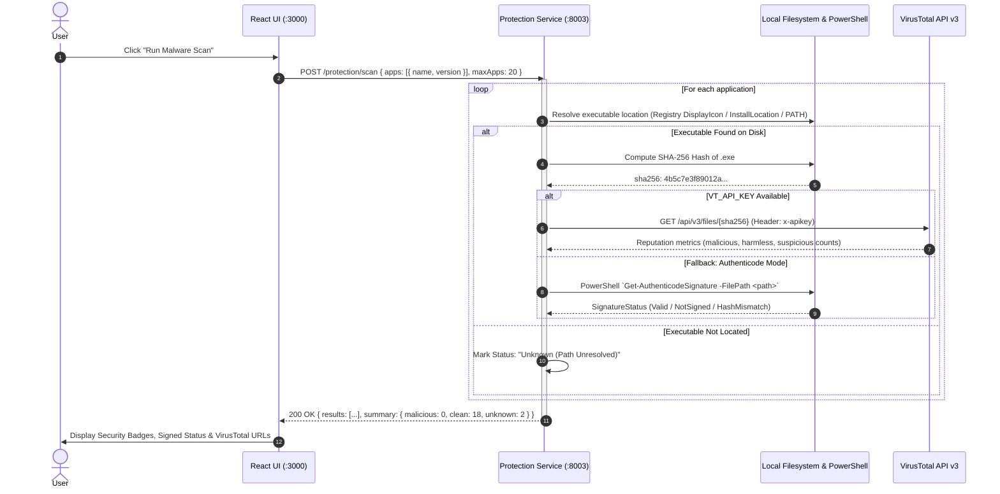
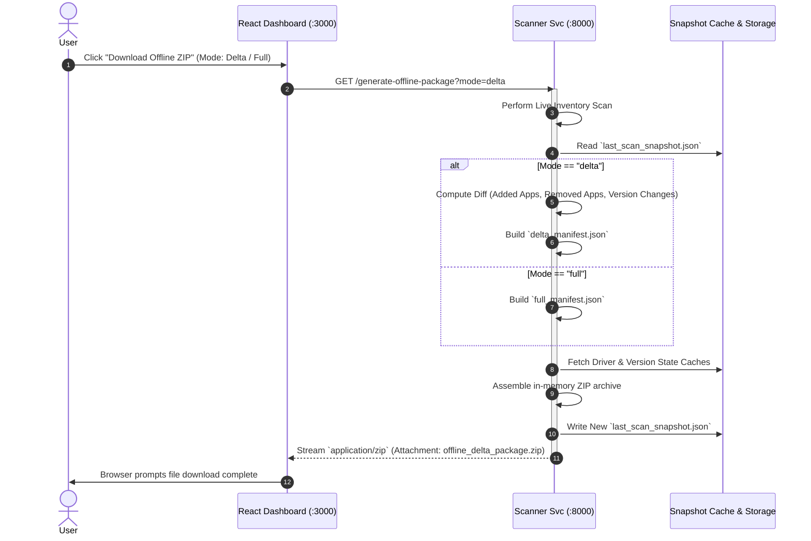
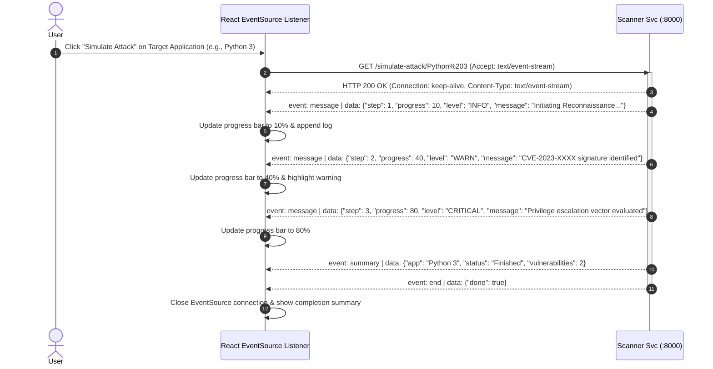

# System Revamp — Architecture & System Design Specification

  <strong>Comprehensive Technical Architecture, System Workflows, API Sequences, and Subsystem Specifications</strong>

---

## 1. 🌟 System Overview & Executive Summary

**System Revamp** is a modular, high-throughput system intelligence, driver diagnostics, software version auditing, and binary threat protection platform. It delivers real-time visibility into installed applications, driver health, update drift, binary authenticity, and offline package synchronization.

The system is architected as a **decoupled multi-tier microservices ecosystem** backing a high-performance **React 18 & Material-UI** glassmorphic dashboard.

---

## 2. 🏛️ High-Level System Architecture & Topology

```mermaid
graph TB
    %% STYLING
    classDef clientStyle fill:#1e293b,stroke:#38bdf8,stroke-width:2px,color:#f8fafc;
    classDef serviceStyle fill:#1e1b4b,stroke:#a855f7,stroke-width:2px,color:#f8fafc;
    classDef nativeStyle fill:#2e1065,stroke:#c084fc,stroke-width:2px,color:#f8fafc;
    classDef dbStyle fill:#0f172a,stroke:#3b82f6,stroke-width:2px,color:#f8fafc;
    classDef osStyle fill:#1e293b,stroke:#10b981,stroke-width:2px,color:#f8fafc;
    classDef cloudStyle fill:#3b0764,stroke:#ec4899,stroke-width:2px,color:#f8fafc;

    %% CONTAINERIZED DOCKER COMPOSE TIER
    subgraph Docker_Compose_Tier["🐳 Containerized Stack (Linux Docker Compose)"]
        UI["🖥️ React 18 Dashboard<br/>Port: 3000 (Nginx)"]:::clientStyle
        ScannerSvc["🔍 Scanner Service<br/>Port: 8000 (FastAPI)<br/>• Inventory & Packager<br/>• SSE Threat Simulator"]:::serviceStyle
        VersionSvc["📦 Version Intelligence<br/>Port: 8002 (FastAPI)<br/>• SemVer Drift Evaluator<br/>• Live Winget/PyPI Query"]:::serviceStyle
        PostgresDB["🐘 PostgreSQL 16 DB<br/>Port: 5432 (Internal/Host)<br/>• Scan Snapshots<br/>• Version Catalogs<br/>• Driver Audit History"]:::dbStyle
        RedisCache["⚡ Redis 7 Cache<br/>Port: 6379 (Internal/Host)<br/>• Version Lookups (TTL 1h)<br/>• VT Rate Limiter (4/min)<br/>• Threat/Sig Cache (24h)"]:::dbStyle
    end

    %% NATIVE WINDOWS HOST TIER
    subgraph Native_Windows_Tier["💻 Native Windows Host Microservices (uvicorn)"]
        DriverSvc["🚗 Driver Risk Service<br/>Port: 8001 (FastAPI Native)<br/>• Hardware Driver Audit<br/>• Risk Score Engine<br/>• PnP / Windows Update Pipeline"]:::nativeStyle
        ProtectSvc["🛡️ Protection Service<br/>Port: 8003 (FastAPI Native)<br/>• Binary Path Resolver<br/>• Authenticode Verifier<br/>• VirusTotal v3 Client"]:::nativeStyle
    end

    %% LOCAL OS RUNTIME TIER
    subgraph OS_Tier["⚙️ Windows Kernel & Subsystems"]
        Registry["Windows Registry<br/>(HKLM / HKCU Uninstall)"]:::osStyle
        WMIC_CIM["WMI / CIM Subsystem<br/>(Win32_PnPSignedDriver)"]:::osStyle
        PnpUtil["OS Utilities<br/>(pnputil.exe / UsoClient.exe)"]:::osStyle
        PowerShell["PowerShell 5.1/7+<br/>(Get-AuthenticodeSignature)"]:::osStyle
    end

    %% EXTERNAL CLOUD SERVICES
    subgraph Cloud_Tier["☁️ External Intelligence Providers"]
        VT["VirusTotal API v3<br/>(File Hash Reputation)"]:::cloudStyle
        WingetRepo["Microsoft Winget Repo<br/>(Package Version Manifests)"]:::cloudStyle
        PyPIRepo["PyPI REST API<br/>(Python Package Index)"]:::cloudStyle
    end

    %% FRONTEND CONNECTIONS
    UI -- "GET /scan | POST /generate-remediation-script | GET /simulate-attack" --> ScannerSvc
    UI -- "GET /drivers | POST /drivers/download" --> DriverSvc
    UI -- "POST /check-versions" --> VersionSvc
    UI -- "POST /protection/scan" --> ProtectSvc

    %% PERSISTENCE & CACHE CONNECTIONS
    ScannerSvc --> PostgresDB
    ScannerSvc --> RedisCache
    VersionSvc --> PostgresDB
    VersionSvc --> RedisCache
    DriverSvc -- "localhost:5432" --> PostgresDB
    ProtectSvc -- "localhost:6379" --> RedisCache

    %% NATIVE PROCESS OS ACCESS
    DriverSvc --> WMIC_CIM
    DriverSvc --> PnpUtil
    ProtectSvc --> Registry
    ProtectSvc --> PowerShell
    ProtectSvc -- "HTTPS API Key" --> VT
    VersionSvc -. "Query CLI" .-> WingetRepo
    VersionSvc -. "HTTP REST" .-> PyPIRepo
```

---

## 3. 📂 Microservice Breakdown & Responsibilities

| Service Name | Default Port | Deployment Target | Primary Responsibilities | Core Dependencies & State Storage |
|---|---|---|---|---|
| **Scanner Service** | `8000` | Docker (Linux) | Application inventory discovery, offline ZIP generator, unattended PowerShell remediation generator, SSE attack simulation. | `fastapi`, `asyncio`, PostgreSQL (`scan_snapshots`), Redis |
| **Driver Risk Service** | `8001` | Native Windows Host | Device driver inventory, missing driver classification, impact scoring, automated Windows update installation triggers. | `Get-CimInstance Win32_PnPSignedDriver`, `UsoClient.exe`, `pnputil.exe`, PostgreSQL (`driver_history`) |
| **Version Intelligence Service** | `8002` | Docker (Linux) | Version drift calculation, package repository querying, semantic version comparison, risk stratification. | `packaging.version`, Winget CLI, PyPI REST API, Redis (`sr:version:*`), PostgreSQL (`latest_versions`) |
| **Software Protection Service** | `8003` | Native Windows Host | Target executable discovery, SHA-256 hash calculation, VirusTotal reputation checks, PowerShell Authenticode signature validation. | `hashlib`, `requests`, `Get-AuthenticodeSignature`, VirusTotal API v3, Redis (`sr:vt:*`, `sr:sig:*`, Rate Limit) |
| **PostgreSQL Database** | `5432` | Docker (Linux) | Persistent transactional storage for scan snapshots, version drift records, and driver audit history. | PostgreSQL 16 Alpine, Persistent Docker Volume (`postgres_data`) |
| **Redis Cache & Limiter** | `6379` | Docker (Linux) | In-memory distributed caching for version checks, threat signatures, and sliding-window rate limiting for VirusTotal API. | Redis 7 Alpine, Persistent Docker Volume (`redis_data`) |

---

## 4. 👤 End-to-End User Interaction Flowchart

---

## 5. 🔄 Sequence Diagrams & API Execution Pipelines

### 5.1 Initial Dashboard Hydration & Multi-Service Aggregation

```mermaid
sequenceDiagram
    autonumber
    actor User
    participant UI as React Dashboard (:3000)
    participant Scanner as Scanner Svc (:8000)
    participant Version as Version Svc (:8002)
    participant Driver as Driver Svc (:8001)
    participant OS as Host OS (WinReg/WMI)

    User->>UI: Open http://localhost:3000
    activate UI
    
    par Parallel Scan Phase
        UI->>Scanner: GET /scan
        activate Scanner
        Scanner->>OS: Query Registry (HKLM/HKCU Uninstall)
        OS-->>Scanner: Return Installed App Names & Versions
        Scanner-->>UI: 200 OK [{ name: "Chrome", version: "128.0" }, ...]
        deactivate Scanner

        UI->>Driver: GET /drivers
        activate Driver
        Driver->>OS: Query CIM (Win32_PnPSignedDriver)
        OS-->>Driver: Return Hardware Device Drivers
        Driver->>Driver: Match against Catalog & Compute RiskScores
        Driver-->>UI: 200 OK { missingDrivers: [...], riskSummary: {...} }
        deactivate Driver
    end

    Note over UI,Version: Step 2: Correlate versions with package drift
    UI->>Version: POST /check-versions { "Chrome": "128.0", "Python": "3.11" }
    activate Version
    Version->>Version: Compare against latest_versions.json / Winget / PyPI
    Version-->>UI: 200 OK [{ name: "Chrome", current: "128.0", latest: "128.0", status: "Up-to-date", riskLevel: "Low" }]
    deactivate Version

    UI->>User: Render Interactive Dashboard & Health Meters
    deactivate UI
```

---

### 5.2 Binary Protection & Authenticode Verification Pipeline

---

### 5.3 Offline Synchronization & Delta Packaging Pipeline

---

### 5.4 Real-Time Attack Simulation (Server-Sent Events)

---

## 6. 🛡️ Resilience, Fallback & Security Architecture

1. **Non-Blocking Degradation**:
   - **VirusTotal API Quotas / Missing Key**: When no API key is provided or quotas are exceeded, the Protection Service transparently falls back to local PowerShell Authenticode digital signature validation.
   - **Registry Fault Tolerance**: Corrupt or inaccessible keys in `HKLM` or `HKCU` are skipped individually without aborting the discovery scan.
2. **Process Timeouts & Concurrency**:
   - Operating system subroutines (`UsoClient`, `pnputil`, `Get-CimInstance`, `Get-AuthenticodeSignature`) run with strict execution timeouts (15s–30s) to prevent hanging I/O loops.
3. **CORS & Microservice Isolation**:
   - Each FastAPI microservice runs on a dedicated port with explicit CORS headers, ensuring failure in one service does not take down other capabilities.
