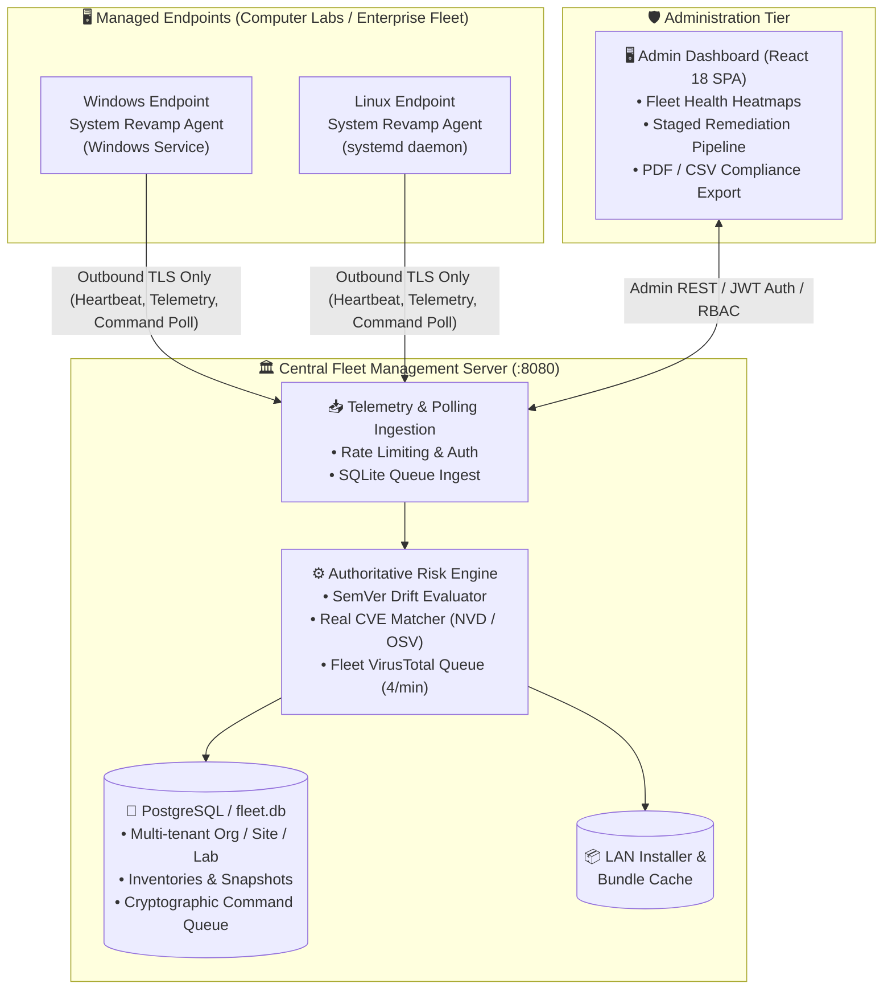
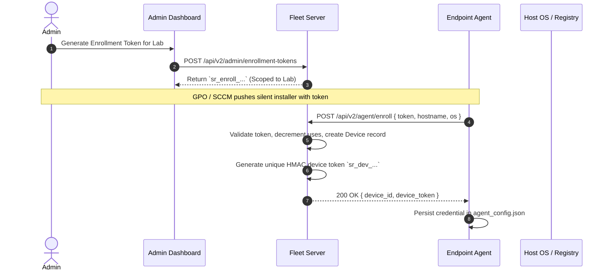
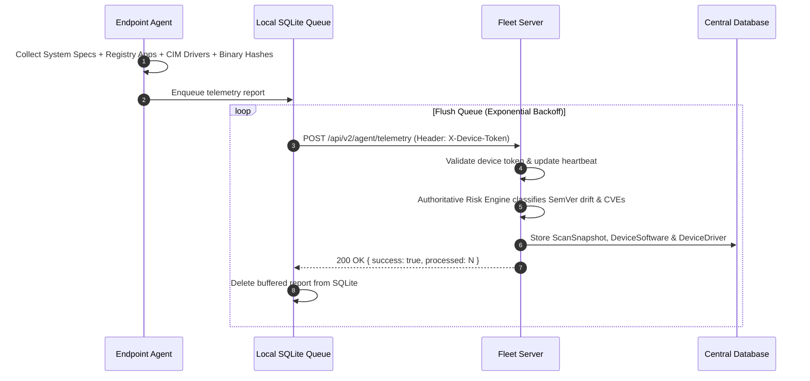
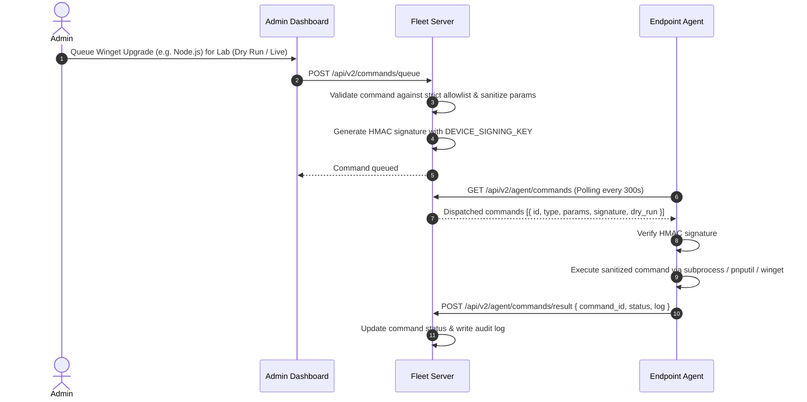

# System Revamp v2.0 — Architecture & System Design Specification

  <strong>Enterprise Fleet-Managed Endpoint Intelligence, PnP Driver Diagnostics, Binary Integrity & Vulnerability Platform</strong>

---

## 1. System Overview & Target Deployment

**System Revamp v2.0** is an enterprise-grade endpoint intelligence and automated remediation platform engineered for university computer labs, academic workstations, and large enterprise fleets.

The platform employs an **outbound-only background agent daemon** running across managed endpoints that continuously streams hardware health, software inventory, binary code signatures, and driver error codes to a centralized **Fleet Management Server**. Administrators manage the entire fleet through a unified, glassmorphic **React 18 Admin Console**.

```mermaid
flowchart TD
    subgraph Endpoints ["🖥️ Managed Endpoints (Computer Labs / Enterprise Fleet)"]
        AgentWin["Windows Endpoint<br/>System Revamp Agent<br/>(Windows Service)"]
        AgentLin["Linux Endpoint<br/>System Revamp Agent<br/>(systemd daemon)"]
    end

    subgraph Server_Tier ["🏛️ Central Fleet Management Server (:8080)"]
        Ingest["📥 Telemetry & Polling Ingestion<br/>• Rate Limiting & Auth<br/>• SQLite Queue Ingest"]
        RiskEngine["⚙️ Authoritative Risk Engine<br/>• SemVer Drift Evaluator<br/>• Real CVE Matcher (NVD / OSV)<br/>• Fleet VirusTotal Queue (4/min)"]
        DB[("🐘 PostgreSQL / fleet.db<br/>• Multi-tenant Org / Site / Lab<br/>• Inventories & Snapshots<br/>• Cryptographic Command Queue")]
        InstallerCache[("📦 LAN Installer &<br/>Bundle Cache")]
    end

    subgraph Admin_Tier ["🛡️ Administration Tier"]
        Dashboard["🖥️ Admin Dashboard (React 18 SPA)<br/>• Fleet Health Heatmaps<br/>• Staged Remediation Pipeline<br/>• PDF / CSV Compliance Export"]
    end

    AgentWin -- "Outbound TLS Only (Heartbeat, Telemetry, Command Poll)" --> Ingest
    AgentLin -- "Outbound TLS Only (Heartbeat, Telemetry, Command Poll)" --> Ingest
    Ingest --> RiskEngine
    RiskEngine --> DB
    RiskEngine --> InstallerCache
    Dashboard <-- "Admin REST / JWT Auth / RBAC" --> Ingest
```

---

## 2. Core Subsystems & Responsibilities

| Subsystem | Binary / Service | Primary Role |
|---|---|---|
| **Endpoint Agent** | `agent.main` | Outbound-only background daemon. Collects Windows Registry software, CIM PnP driver problem codes, and calculates local binary SHA-256 hashes with Authenticode signature status. Buffers reports in local SQLite queue if offline. |
| **Central Server** | `server.main` | Centralized FastAPI service. Manages multi-tenant Org/Site/Lab hierarchies, evaluates version drift risk, matches CVEs, queues commands with HMAC signatures, and manages the fleet-wide VirusTotal cache. |
| **Admin Dashboard** | `dashboard/` | React 18 SPA. Displays compliance gauges, lab health heatmaps, single-machine deep inspections, staged rollouts, and CSV/PDF compliance export. |

---

## 3. Communication Protocols & Workflows

### 3.1 Agent Enrollment Sequence

```mermaid
sequenceDiagram
    autonumber
    actor Admin
    participant Dashboard as Admin Dashboard
    participant Server as Fleet Server
    participant Agent as Endpoint Agent
    participant OS as Host OS / Registry

    Admin->>Dashboard: Generate Enrollment Token for Lab
    Dashboard->>Server: POST /api/v2/admin/enrollment-tokens
    Server-->>Dashboard: Return `sr_enroll_...` (Scoped to Lab)
    
    Note over Admin,Agent: GPO / SCCM pushes silent installer with token
    Agent->>Server: POST /api/v2/agent/enroll { token, hostname, os }
    Server->>Server: Validate token, decrement uses, create Device record
    Server->>Server: Generate unique HMAC device token `sr_dev_...`
    Server-->>Agent: 200 OK { device_id, device_token }
    Agent->>Agent: Persist credential in agent_config.json
```

### 3.2 Telemetry Ingestion & Risk Scoring Pipeline

```mermaid
sequenceDiagram
    autonumber
    participant Agent as Endpoint Agent
    participant Queue as Local SQLite Queue
    participant Server as Fleet Server
    participant DB as Central Database

    Agent->>Agent: Collect System Specs + Registry Apps + CIM Drivers + Binary Hashes
    Agent->>Queue: Enqueue telemetry report
    
    loop Flush Queue (Exponential Backoff)
        Queue->>Server: POST /api/v2/agent/telemetry (Header: X-Device-Token)
        Server->>Server: Validate device token & update heartbeat
        Server->>Server: Authoritative Risk Engine classifies SemVer drift & CVEs
        Server->>DB: Store ScanSnapshot, DeviceSoftware & DeviceDriver
        Server-->>Queue: 200 OK { success: true, processed: N }
        Queue->>Queue: Delete buffered report from SQLite
    end
```

### 3.3 Command Queue & Remediation Pipeline

```mermaid
sequenceDiagram
    autonumber
    actor Admin
    participant Dashboard as Admin Dashboard
    participant Server as Fleet Server
    participant Agent as Endpoint Agent

    Admin->>Dashboard: Queue Winget Upgrade (e.g. Node.js) for Lab (Dry Run / Live)
    Dashboard->>Server: POST /api/v2/commands/queue
    Server->>Server: Validate command against strict allowlist & sanitize params
    Server->>Server: Generate HMAC signature with DEVICE_SIGNING_KEY
    Server-->>Dashboard: Command queued

    Agent->>Server: GET /api/v2/agent/commands (Polling every 300s)
    Server-->>Agent: Dispatched commands [{ id, type, params, signature, dry_run }]
    Agent->>Agent: Verify HMAC signature
    Agent->>Agent: Execute sanitized command via subprocess / pnputil / winget
    Agent->>Server: POST /api/v2/agent/commands/result { command_id, status, log }
    Server->>Server: Update command status & write audit log
```

---

## 4. Authoritative Risk Classification Engine

To ensure mathematical precision across all audits, version drift is evaluated according to the deterministic rule set:

$$\text{Risk Level} = \begin{cases}
\mathbf{Critical}, & \text{if } \text{Major Jump} \ge 2 \text{ or known-vulnerable (CVSS } \ge 7.0\text{)} \\
\mathbf{High}, & \text{if } \text{Major Jump} = 1 \text{ or deprecated} \\
\mathbf{Medium}, & \text{if } \text{Minor Jump} \ge 1 \\
\mathbf{Low}, & \text{if } \text{Patch Jump} \ge 1 \text{ or current } (\text{Current} \ge \text{Latest}) \\
\mathbf{Unknown}, & \text{if versions cannot be parsed or matched}
\end{cases}$$
